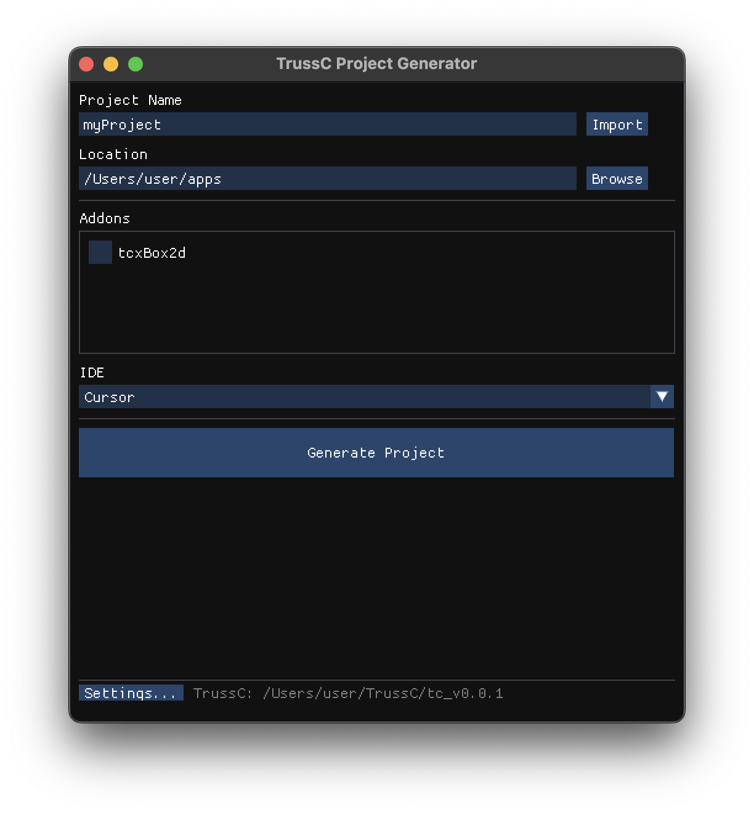

# TrussC をはじめよう

TrussC は openFrameworks ライクな軽量クリエイティブコーディングフレームワーク。
C++20 + sokol ベースで、シンプルに書けてクロスプラットフォームで動く。

---

## 1. 環境を準備する

### 必要なもの

| OS | コンパイラ |
|----|-----------|
| macOS | Xcode Command Line Tools（`xcode-select --install`） |
| Windows | Visual Studio 2022 |
| Linux | GCC 10+ または Clang 10+ |

**CMake** も必要：
```bash
# macOS
brew install cmake

# Windows
winget install Kitware.CMake

# Linux
sudo apt install cmake
```

### エディタの準備（VSCode / Cursor）

以下の拡張機能をインストール：

| 拡張機能 | 用途 | 必要な OS |
|----------|------|-----------|
| **CMake Tools** | ビルド統合 | 全 OS |
| **C/C++** | IntelliSense + デバッグ | 全 OS（Windows はデバッグにも使用） |
| **CodeLLDB** | デバッグ実行 | macOS / Linux |

---

## 2. Project Generator をビルドする

初回のみ、プロジェクト作成ツールをビルドする。

**macOS:** `projectGenerator/buildProjectGenerator_mac.command` をダブルクリック

**Windows:** `projectGenerator/buildProjectGenerator_win.bat` をダブルクリック

---

## 3. プロジェクトを作る



1. **Project Name** を入力
2. **Location** で保存先を選択
3. **IDE** で `Cursor` または `VSCode` を選択
4. **Generate Project** をクリック

---

## 4. ビルドして実行する

1. **Open in IDE** でプロジェクトを開く
2. `F7` でビルド（または `Cmd+Shift+B` / `Ctrl+Shift+B`）
3. `F5` で実行

これだけ！

---

## 5. サンプルを動かす

`examples/` フォルダにたくさんのサンプルがある。

```
examples/
├── graphics/      # 2D 描画
├── 3d/            # 3D 描画
├── sound/         # サウンド
├── network/       # ネットワーク
├── gui/           # ImGui
└── ...
```

サンプルも同じ手順で動かせる：
1. Project Generator で **Import** ボタンをクリック
2. サンプルフォルダを選択
3. **Open in IDE** → `F5`

---

## 6. コードを書く

基本的な構造：

```cpp
// tcApp.h
#pragma once
#include "tcBaseApp.h"
using namespace tc;
using namespace std;

class tcApp : public App {
public:
    void setup() override;
    void update() override;
    void draw() override;
};
```

```cpp
// tcApp.cpp
#include "tcApp.h"

void tcApp::setup() {
    // 初期化
}

void tcApp::update() {
    // 毎フレーム更新
}

void tcApp::draw() {
    clear(30);  // 背景色

    setColor(colors::white);
    drawCircle(getWidth()/2, getHeight()/2, 100);
}
```

---

## 次のステップ

- [TrussC_vs_openFrameworks.md](TrussC_vs_openFrameworks.md) - oF ユーザー向け API 対応表
- [HOW_TO_BUILD.md](HOW_TO_BUILD.md) - 詳細なビルド方法、アイコン設定、配布など
- [ADDONS.md](ADDONS.md) - アドオンの使い方
- [DESIGN.md](DESIGN.md) - 内部設計について
