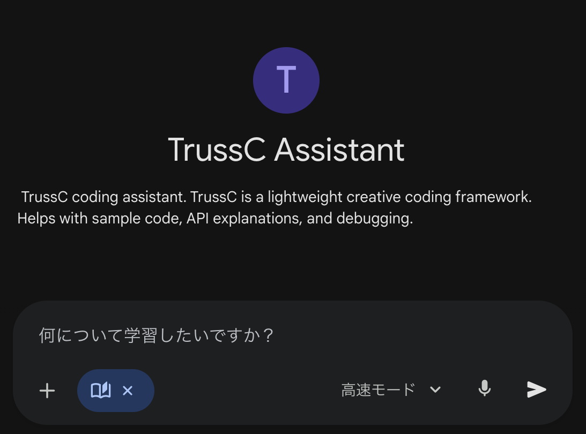

# Getting Started with TrussC

TrussC is a lightweight creative coding framework inspired by openFrameworks.
Built on C++20 + sokol, it's simple to write and runs cross-platform.

---

## AI Assistant

<p align="center">
  <a href="https://gemini.google.com/gem/16aq3ccVPl33j6xSMyE7MWXDjaZvauL0I">
    
  </a>
</p>

**[TrussC Assistant](https://gemini.google.com/gem/16aq3ccVPl33j6xSMyE7MWXDjaZvauL0I)** - A Gemini-based AI that knows TrussC. Ask questions about APIs, get code examples, or troubleshoot issues.

---

## 1. Set Up Your Environment

### Requirements

| OS | Compiler |
|----|----------|
| macOS | Xcode Command Line Tools (`xcode-select --install`) |
| Windows | Visual Studio 2022 |
| Linux | GCC 10+ or Clang 10+ |

**CMake** is also required:
```bash
# macOS
brew install cmake

# Windows
winget install Kitware.CMake

# Linux
sudo apt install cmake
```

### Editor Setup

#### VSCode

| Extension | Purpose |
|-----------|---------|
| **CMake Tools** | Build integration |
| **C/C++** | IntelliSense + debugging |
| **CodeLLDB** | Debug execution (macOS / Linux) |

#### Cursor

| Extension | Purpose |
|-----------|---------|
| **CMake Tools** | Build integration |
| **clangd** | IntelliSense (C/C++ extension is blocked in Cursor) |
| **CodeLLDB** | Debug execution (macOS / Linux) |

---

## 2. Build the Project Generator

Build the project creation tool (first time only).

**macOS:** Double-click `projectGenerator/buildProjectGenerator_mac.command`

**Windows:** Double-click `projectGenerator/buildProjectGenerator_win.bat`

---

## 3. Create a Project

<p align="center">
  
</p>

1. Enter a **Project Name**
2. Select a **Location** to save
3. Choose `Cursor` or `VSCode` as **IDE**
4. (Optional) Check **Web Build** to generate Emscripten build scripts
5. Click **Generate Project**

### Web Build (WebGPU)

TrussC supports browser deployment via **WebGPU** (not WebGL). To build for web:

1. Check **Web Build** when generating/updating a project
2. A `build-web.command` (macOS) or `build-web.bat` (Windows) script will be generated
3. Run the script to build, then open `bin/<projectName>.html` in a WebGPU-compatible browser

**VSCode/Cursor:** A "Build Web" task is also added. Run it via `Cmd+Shift+B` / `Ctrl+Shift+B` → "Build Web".

> **Note:** WebGPU requires a modern browser (Chrome 113+, Edge 113+, or Safari 18+).

---

## 4. Build and Run

1. Click **Open in IDE** to open the project
2. Press `F7` to build (or `Cmd+Shift+B` / `Ctrl+Shift+B`)
3. Press `F5` to run

That's it!

---

## 5. Run Examples

The `examples/` folder contains many samples.

```
examples/
├── graphics/      # 2D drawing
├── 3d/            # 3D drawing
├── sound/         # Sound
├── network/       # Networking
├── gui/           # ImGui
└── ...
```

Run examples the same way:
1. Click **Import** in Project Generator
2. Select an example folder
3. **Open in IDE** → `F5`

---

## 6. Update Existing Projects

<p align="center">
  
</p>

When you clone a TrussC project or example (e.g., `examples/graphics/graphicsExample`), you need to generate the IDE project files before building.

1. Click **Import** and select the project folder
2. Click **Update Project** to generate CMakeLists.txt and IDE files
3. **Open in IDE** → Build and run

This is also useful when:
- You cloned a repository that only contains source files
- You want to regenerate project files after changing addons
- You want to switch IDE (e.g., VSCode → Cursor)

---

## 7. Write Code

### tcApp.h

```cpp
#pragma once

#include "tcBaseApp.h"
using namespace tc;
using namespace std;

class tcApp : public App {
public:
    // Lifecycle
    void setup() override;      // Called once at start
    void update() override;     // Called every frame (logic)
    void draw() override;       // Called every frame (rendering)
    void exit() override;       // Called before cleanup

    // Key events
    void keyPressed(int key) override;
    void keyReleased(int key) override;

    // Mouse events
    void mousePressed(Vec2 pos, int button) override;
    void mouseReleased(Vec2 pos, int button) override;
    void mouseMoved(Vec2 pos) override;
    void mouseDragged(Vec2 pos, int button) override;
    void mouseScrolled(Vec2 delta) override;

    // Window events
    void windowResized(int width, int height) override;

    // File drop
    void filesDropped(const vector<string>& files) override;
};
```

Override only what you need. All methods have empty default implementations.

### tcApp.cpp

```cpp
#include "tcApp.h"

void tcApp::setup() {
    // Initialization
}

void tcApp::update() {
    // Called every frame
}

void tcApp::draw() {
    clear(30);  // Background color

    setColor(colors::white);
    drawCircle(getWidth()/2, getHeight()/2, 100);
}

void tcApp::keyPressed(int key) {
    if (key == 'f') toggleFullscreen();
}

void tcApp::mousePressed(Vec2 pos, int button) {
    // Handle mouse click at pos.x, pos.y
}

// ... implement other overrides as needed
```

---

## 8. App Icon

Place a **512x512+ PNG** in the `icon/` folder:

```
myProject/
├── icon/
│   └── myicon.png    ← Just put a PNG here!
├── src/
└── CMakeLists.txt
```

The PNG is automatically converted to `.icns` (macOS) or `.ico` (Windows) at build time.

**Windows:** Requires [ImageMagick](https://imagemagick.org/) for PNG → ICO conversion. Alternatively, prepare an `.ico` file directly.

