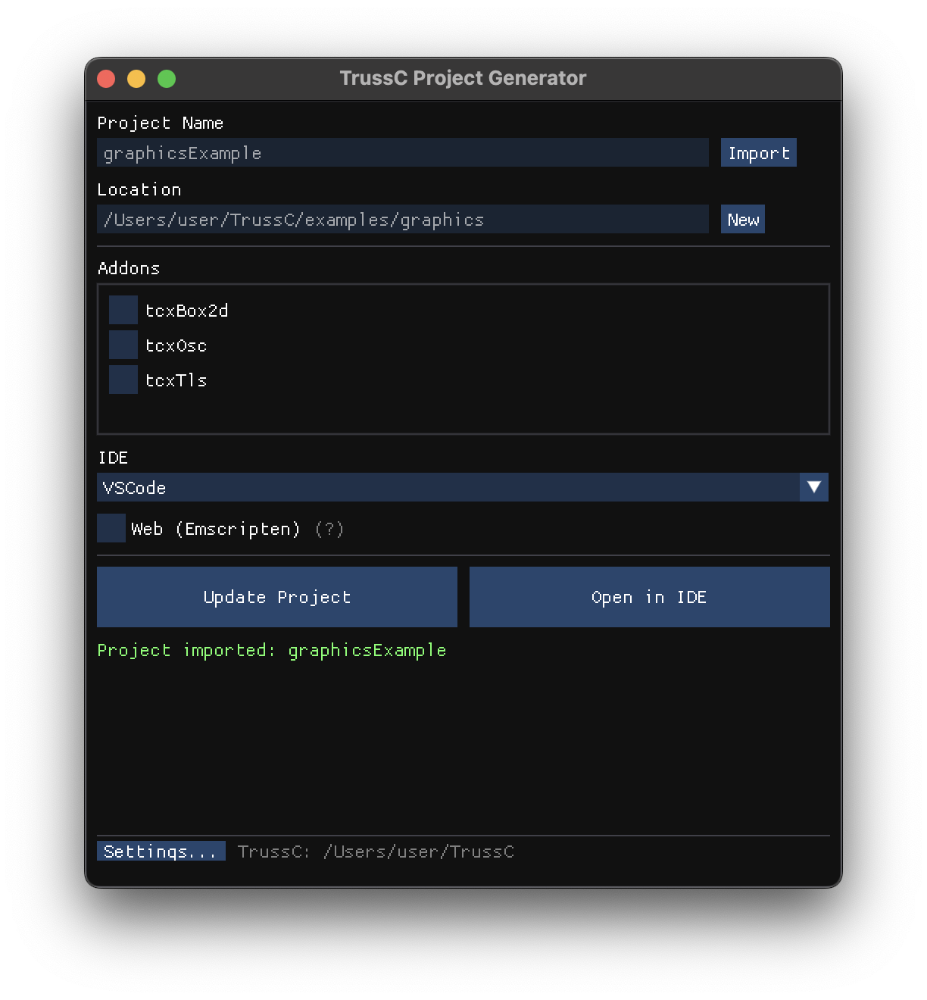

# TrussC ビルド方法

## 前提条件

- CMake 3.20 以上
- C++20 対応コンパイラ
- macOS: Xcode Command Line Tools (`xcode-select --install`)
- Windows: Visual Studio 2022 または MinGW
- Linux: GCC 10+ または Clang 10+

### VSCode / Cursor 拡張機能

VSCode または Cursor を使う場合、以下の拡張機能をインストール：

| 拡張機能 | 用途 |
|----------|------|
| **CMake Tools** | CMake ビルド統合 |
| **CodeLLDB** | デバッグ実行（macOS/Linux） |
| **C/C++** | IntelliSense、コード補完 |

---

## Project Generator を使う（推奨）

TrussC には GUI ベースのプロジェクト生成ツールが付属している。

### 1. Project Generator のビルド

初回のみ、Project Generator 自体をビルドする必要がある。

**macOS:**
```bash
# tools/buildProjectGenerator_mac.command をダブルクリック
# または
cd /path/to/tc_v0.0.1/tools/projectGenerator
mkdir build && cd build
cmake ..
cmake --build .
```

**Windows:**
```bash
# tools/buildProjectGenerator_win.bat をダブルクリック
# または
cd /path/to/tc_v0.0.1/tools/projectGenerator
mkdir build && cd build
cmake ..
cmake --build . --config Release
```

### 2. 新規プロジェクトの作成

Project Generator を起動する。


1. **Project Name**: プロジェクト名を入力
2. **Location**: 保存先フォルダを選択
3. **Addons**: 使用するアドオンにチェック
4. **IDE**: 使用する IDE を選択
   - CMake only: CMakeLists.txt のみ生成
   - VSCode: .vscode/launch.json と settings.json も生成
   - Cursor: VSCode と同様
   - Xcode (macOS): cmake -G Xcode で .xcodeproj を生成
   - Visual Studio (Windows): cmake -G "Visual Studio 17 2022" で .sln を生成
5. **Generate Project** をクリック

### 3. 既存プロジェクトの更新

**Import** ボタンで既存プロジェクトを読み込むと、Update モードになる。



- アドオンの追加/削除
- IDE 設定の変更
- TrussC バージョンの切り替え（Settings から TrussC フォルダを変更）

**Update Project** で CMakeLists.txt と addons.make を更新。
**Open in IDE** で選択した IDE でプロジェクトを開く。

### 4. ビルドと実行

**VSCode / Cursor:**
1. Open in IDE でプロジェクトを開く
2. `F7` または `Cmd+Shift+P` → `CMake: Build`
3. `F5` でデバッグ実行

**Xcode:**
1. Open in IDE で .xcodeproj を開く
2. `Cmd+R` で実行

**Visual Studio:**
1. Open in IDE で .sln を開く
2. `F5` で実行

---

## アドオンの追加

アドオンは2つの方法で追加できる。

### 方法1: Project Generator で追加（推奨）

1. Project Generator でプロジェクトを Import
2. 使用するアドオンにチェック
3. Update Project

### 方法2: addons.make を編集

プロジェクトフォルダの `addons.make` を編集：

```
# TrussC addons - one addon per line
tcxBox2d
tcxSomeAddon
```

詳しくは [ADDONS.md](ADDONS.md) を参照。

---

## CMake を直接使う（上級者向け）

Project Generator を使わずに、コマンドラインで直接ビルドすることもできる。

### 1. テンプレートをコピー

```bash
cp -r /path/to/tc_v0.0.1/examples/templates/emptyExample ~/myProject
cd ~/myProject
```

### 2. TC_ROOT を設定

`CMakeLists.txt` の先頭付近を編集：

```cmake
set(TC_ROOT "/path/to/tc_v0.0.1" CACHE PATH "Path to TrussC")
```

### 3. ビルド

```bash
mkdir build && cd build
cmake ..
cmake --build .
```

### 4. 実行

```bash
# macOS
open bin/myProject.app

# Windows
./bin/myProject.exe

# Linux
./bin/myProject
```

### IDE 用のプロジェクト生成

```bash
# Xcode
cmake -G Xcode ..

# Visual Studio
cmake -G "Visual Studio 17 2022" ..
```

---

## ビルドオプション

### リリースビルド

```bash
cmake --build . --config Release
```

### クリーンビルド

```bash
rm -rf build
mkdir build && cd build
cmake ..
cmake --build .
```

---

## アイコン設定

アプリのアイコンは `icon/` フォルダに画像を配置するだけで設定できる。

### 基本的な使い方（推奨）

**PNG を入れるだけでOK:**

```
myProject/
├── icon/
│   └── myicon.png    ← 512x512 以上の PNG を入れるだけ！
├── src/
└── CMakeLists.txt
```

ビルド時に自動で OS 用のフォーマットに変換される。

### 対応フォーマット

| OS | 優先順位 |
|----|----------|
| macOS | 1. `.icns` → 2. `.png`（自動変換） → 3. デフォルト |
| Windows | 1. `.ico` → 2. `.png`（自動変換） → 3. デフォルト |

- **macOS**: PNG があれば sips + iconutil で `.icns` に自動変換（追加ツール不要）
- **Windows**: PNG があれば ImageMagick で `.ico` に自動変換

### 推奨仕様

- **サイズ**: 512x512 ピクセル以上（1024x1024 推奨）
- **形式**: PNG（透過対応）
- **ファイル名**: 何でもOK（最初に見つかったファイルを使用）

### Windows での PNG 自動変換

Windows で PNG → ICO 変換を使うには **ImageMagick** が必要:

1. [ImageMagick 公式サイト](https://imagemagick.org/script/download.php) からインストーラをダウンロード
2. インストール時に **「Add application directory to your system path」にチェック**
3. コマンドプロンプトで確認:
   ```cmd
   magick --version
   ```

ImageMagick がない場合は自動的にデフォルトアイコンが使われる。
事前に `.ico` ファイルを用意しておけば変換は不要。

### すべて手動で用意する場合

PNG 変換に頼らず、プラットフォーム別のアイコンを自分で用意することもできる:

```
icon/
├── app.icns    ← macOS 用
├── app.ico     ← Windows 用
└── app.png     ← 予備 / Linux 用（将来対応予定）
```

### アイコンなしの場合

`icon/` フォルダがない、または空の場合は TrussC のデフォルトアイコンが使われる。

---

## 配布

TrussC で作成したアプリは静的リンクされるため、外部 DLL は不要。

### 配布構成

```
MyApp/
├── bin/
│   ├── MyApp.exe      (Windows)
│   ├── MyApp          (Linux)
│   └── MyApp.app/     (macOS)
└── data/              (アセットがあれば)
```

フォルダごと Zip 圧縮して配布できる。

---

## トラブルシューティング

### TC_ROOT が設定されていない

```
╔══════════════════════════════════════════════════════════════════╗
║   ERROR: TC_ROOT is not set!                                    ║
║   Use projectGenerator to create or update this project.        ║
╚══════════════════════════════════════════════════════════════════╝
```

→ Project Generator でプロジェクトを作成/更新するか、CMakeLists.txt の TC_ROOT を手動で設定。

### TrussC が見つからない

```
╔══════════════════════════════════════════════════════════════════╗
║   ERROR: TrussC not found!                                      ║
║   Looked in: /path/to/tc_v0.0.1                                 ║
╚══════════════════════════════════════════════════════════════════╝
```

→ TC_ROOT のパスが正しいか確認。Project Generator の Settings で TrussC フォルダを再設定。

### CMake が見つからない

```bash
# macOS (Homebrew)
brew install cmake

# Windows (winget)
winget install Kitware.CMake

# Linux
sudo apt install cmake
```

### コンパイラが見つからない（macOS）

```bash
xcode-select --install
```

### ビルドエラーが出る

```bash
# build フォルダを削除してやり直し
rm -rf build
mkdir build && cd build
cmake ..
cmake --build .
```
